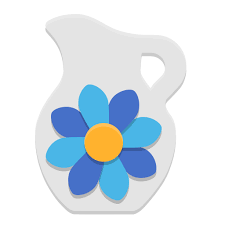
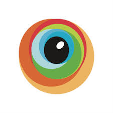
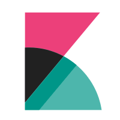
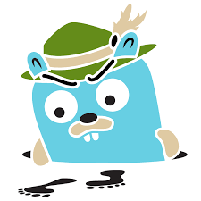

# Привет! 👋 
Меня зовут Артем, я QA Инженер!

## 📊 Статистика

### 👩‍💻 Обо мне:

Мне нравится решать сложные задачи! Тестирование - моя зона комфорта: разбираю продукт на части, ловлю баги там, где их «не может быть», и превращаю хаос в чек-листы с умом.

Пишу баг-репорты, в которых разработчик сразу понимает суть. Автоматизирую рутину - от подготовки тестовых данных до проверки окружения - чтобы тратить время на тестирование, а не на клики.

Комфортно работаю без документации (часто она появляется только после моих вопросов) и легко беру ответственность за качество, будь я единственным QA или частью команды.

Слежу за инструментами, пробую новое - от анализа логов до настройки проверок в CI. Расту как специалист и верю: хороший тестировщик - тот, кого бэклог багов пугает меньше, чем отсутствие задач.

Открыт к сотрудничеству и стремлюсь присоединиться к сильной команде высококвалифицированных специалистов для работы над интересными проектами.

 

## Тестирование API и интеграций

            <!--Postman-->
            &nbsp
            <!--REST-->
            &nbsp
            <!--SOAP-->
            &nbsp
            <!--KAFKA-->
            &nbsp
            <!--SWAGGER-->
            &nbsp
            <!--DOCKER-->
            &nbsp

## Тестирование Web и Мобильных приложений

            <!--FIGMA-->
            &nbsp
            <!--HTTP-->
            &nbsp
            <!--HTML-->
            &nbsp
            <!--CSS-->
            &nbsp
            <!--JavaScript-->
            &nbsp
            <!--FireBase-->
            &nbsp
            <!--AndroidStudio-->
            &nbsp
            <!--CHARLES-->
            &nbsp
            <!--BrowserStack-->
            &nbsp

## Логи и мониторинги

            <!--KIBANA-->
            &nbsp
            <!--SENTRY-->
            &nbsp
            <!--GRAFANA-->
            &nbsp
            <!--JAEGER-->
            &nbsp
            <!--BASH-->
            &nbsp

## Тестовая документация 
  

            <!--YandexTracker-->
            &nbsp
            <!--JIRA-->
            &nbsp
            <!--Test_IT-->
            &nbsp
            <!--BUILDIN-->
            &nbsp
            <!--MIRO-->
            &nbsp
  

## Работа с базами данных

            <!--PostgreSQL-->
            &nbsp
            <!--MySQL-->
            &nbsp
            <!--MongoDB-->
            &nbsp
            <!--METABASE-->
            &nbsp
            <!--DBeaver-->
            &nbsp
            <!--REDIS-->
            &nbsp

## Автотесты

            <!--CYPRESS-->
            &nbsp
            <!--SELENIUM-->
            &nbsp
            <!--PYTEST-->
            &nbsp
            <!--GutHub-->
            &nbsp
            <!--VS_Code-->
            &nbsp
            <!--Sublime-->
            &nbsp

 

## 🤝 Готов обсудить проекты, идеи и возможности сотрудничества

